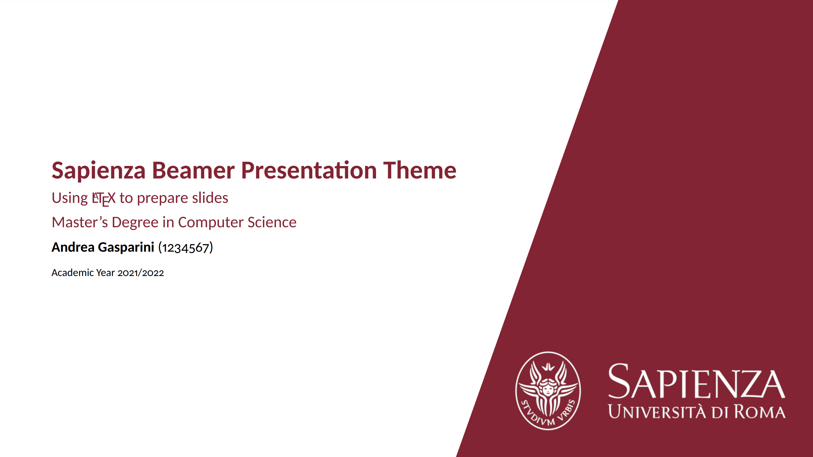
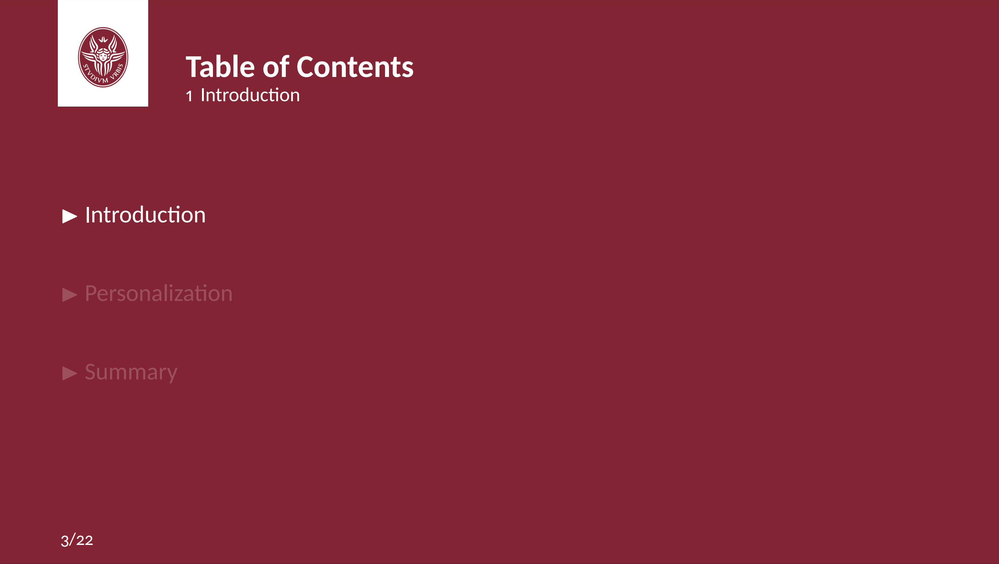
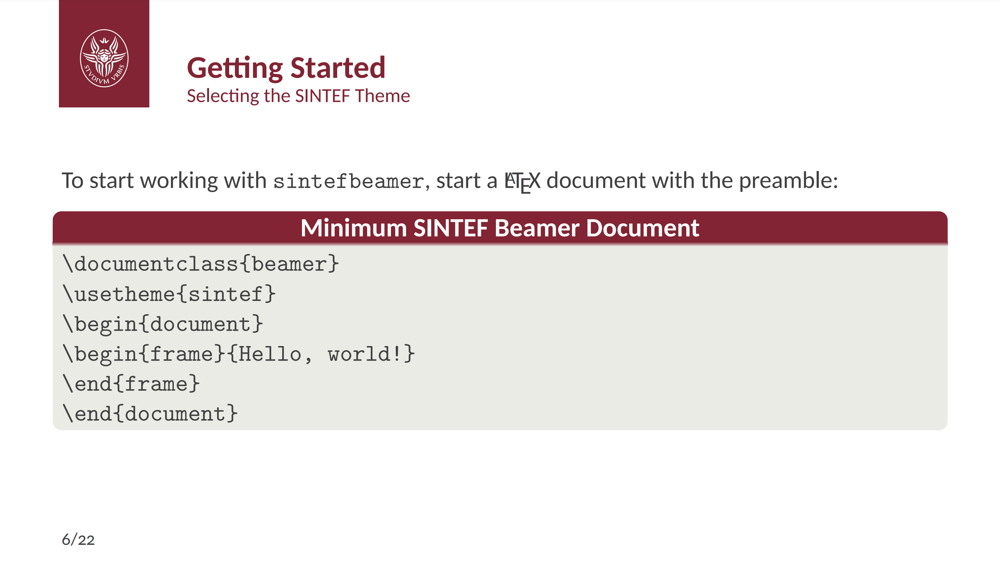
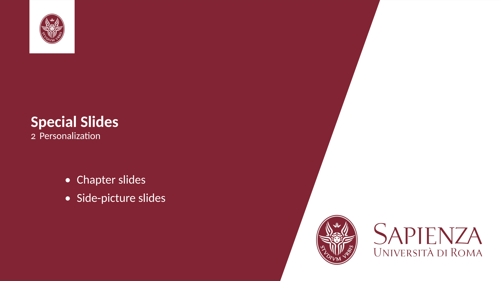
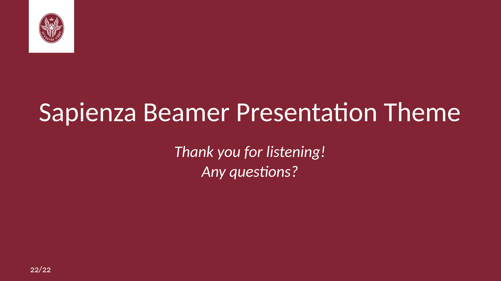

# Sapienza Beamer Presentation Template

This is an **unofficial** template to create slides with LaTeX beamer for Sapienza University of Rome.

The template is already available on Overleaf Gallery and can be directly used by clicking on "Open as Template" from [here](https://www.overleaf.com/latex/templates/sapienza-presentation/yyksmrskffhk).

## Screenshots

### Title page

### Table of Contents

### Code blocks

### Side-picture slides

### Final thanks

---

This template is based on [SINTEF Presentation](https://www.overleaf.com/latex/templates/sintef-presentation/jhbhdffczpnx) from [Federico Zenith](mailto:federico.zenith@sintef.no) and some addition are inspired by its derivation [Beamer-LaTeX-Themes](https://github.com/TOB-KNPOB/Beamer-LaTeX-Themes) from Liu Qilong